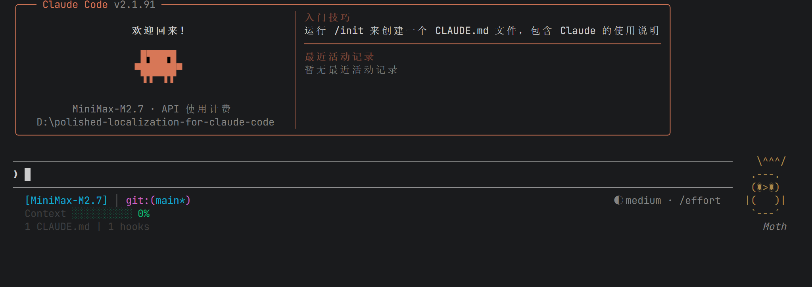
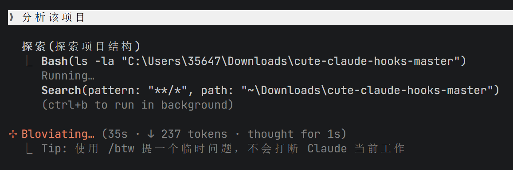
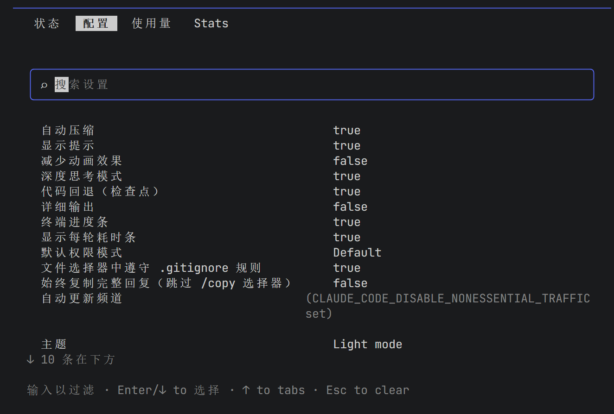
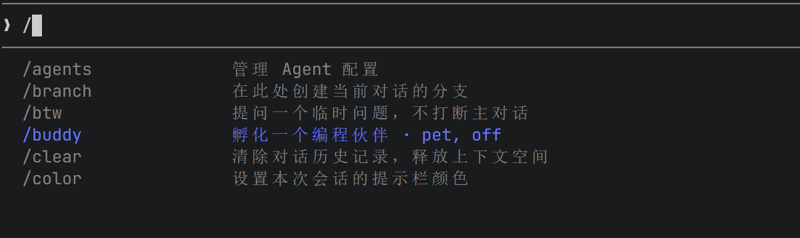

# ✨ Polished Localization for Claude Code

[](https://opensource.org/licenses/MIT)
[](https://claude.ai/code)
[](https://www.npmjs.com/package/polished-localization-for-claude-code)
[](https://github.com/Dublin1231/polished-localization-for-claude-code)
[](https://github.com/Dublin1231/polished-localization-for-claude-code/actions/workflows/test-localization.yml)

> Polished Localization for Claude Code 是一个面向 Claude Code 的高质量中文本地化与可用性增强工具包，不仅提供完整的界面翻译，还通过上下文感知的工具提示把每一步操作解释清楚，帮助用户快速理解 Claude 在做什么、为什么这么做。项目覆盖 Windows/macOS/Linux 跨平台安装与恢复流程，内置可维护的词条映射与替换机制，支持持续扩展和版本迭代，适合个人开发者、中文团队以及希望构建稳定中文开发体验的场景。
>
> 本项目基于 MIT 许可的社区方案演进重构，已保留许可证与归属信息并进行独立维护。

> **💡 安装方式说明：**
> - **Hook 脚本**（工具提示 + 任务完成通知）：支持 **NPM 安装** 和 **手动安装** 两种方式
> - **界面汉化**（配置面板、命令说明等）：**仅支持 NPM 安装**，暂不支持手动安装

## 📸 效果预览

### 🎯 工具提示效果

每个 Claude Code 执行的操作都会显示中文提示，让你清楚知道它在做什么：





### 🌐 界面汉化效果





### 📝 汉化对照表

| 原文 (English) | 译文 (中文) |
|---------------|------------|
| Welcome back! | 欢迎回来! |
| Auto-compact | 自动压缩 |
| Thinking mode | 深度思考模式 |
| Esc to cancel | Esc 取消 |
| Enter to submit · Esc to cancel | Enter 提交 · Esc 取消 |
| Recent activity | 最近活动记录 |
| Tips for getting started | 入门技巧 |

### 📋 支持的命令解释

| 命令类型 | 示例命令 | 中文解释 |
|---------|---------|---------|
| **GitHub CLI** | `gh run list` | 🚀 列出 GitHub Actions 运行记录（查看自动化测试历史） |
| | `gh auth status` | 🔐 检查 GitHub 登录状态（看是否已登录、登录的是哪个账号） |
| | `gh repo create` | 📦 在 GitHub 上创建新仓库（新建一个代码存储库） |
| **Git** | `git push` | 📚 推送到远程仓库（上传代码到服务器） |
| | `git log` | 📜 查看提交日志（看所有修改记录） |
| | `git status` | 📊 查看工作区状态（哪些文件改了） |
| **npm** | `npm install` | 📦 安装依赖包（下载项目所需的库） |
| | `npm run build` | 🏗️ 构建项目（编译打包代码） |
| **pip** | `pip install` | 📦 安装 Python 包（下载 Python 库） |
| | `pip list` | 📋 列出已安装的包（查看 Python 库） |
| **网络** | `curl` | 🌐 获取网页内容（下载或查看网页数据） |
| | `ping` | 🌐 测试网络连接（检查能否连上某个地址） |
| **文件** | `cat` | 📖 查看文件内容（打开文本文件阅读） |
| | `mkdir` | 📁 创建新目录（新建文件夹） |

> 💡 支持 **100+** 常用命令的详细中文解释！

---

## ✨ 特性

- 📖 **中文操作提示** - 每个操作都有详细的中文解释，小白也能看懂
- ✨ **界面汉化** - 配置面板、命令说明、快捷键提示全中文
- 🖥️ **跨平台** - Windows/macOS/Linux 通用
- 📦 **轻量级** - 无依赖，秒级安装
- 🔧 **易自定义** - 完整的自定义指南
- 🇨🇳 **国内加速** - 支持 npmmirror 镜像安装
- 🧪 **自动测试** - GitHub Actions 三平台自动测试
- 🐾 **满级 Buddy** - 解锁并自定义你的 Claude Code 宠物伙伴（支持 18 种宠物、满级属性、闪光效果、皇冠帽子）

---

## 📦 安装

### 功能与安装方式对应表

| 功能 | NPM 安装 | 手动/脚本安装 |
|------|:--------:|:------------:|
| 📖 工具提示 Hook (tool-tips-post.sh) | ✅ | ✅ |
| 🔔 任务完成通知 Hook (task-done-notify.sh) | ✅ | ✅ |
| 🌐 界面汉化 (配置面板、斜杠命令等) | ✅ | ❌ 暂不支持 |

> 界面汉化需要修改 Claude Code 内部文件，目前仅通过 NPM 安装脚本自动完成，暂不提供手动安装方式。

### 方式一：NPM 安装（推荐）

```bash
# 全局安装
npm install -g polished-localization-for-claude-code

# 运行安装脚本
polished-localization-install

# 恢复英文界面
polished-localization-restore
```

**或者使用 npx（无需全局安装）：**
```bash
npx polished-localization-install
```

### 方式二：国内加速安装（推荐国内用户）

如果 npm 官方源速度慢，可以使用国内镜像：

```bash
# 使用 npmmirror 镜像安装
npm install -g polished-localization-for-claude-code --registry=https://registry.npmmirror.com

# 运行安装脚本
polished-localization-install
```

**或者使用 npx：**
```bash
npx polished-localization-install
```

### 安装选项

```
╔════════════════════════════════════════╗
║ ✨ Polished Localization 安装向导 ✨ ║
╠════════════════════════════════════════╣
║  [1] 仅安装工具提示 (推荐新手)         ║
║  [2] 仅安装界面汉化                    ║
║  [3] 全部安装 (完整中文体验) ← 推荐    ║
║  [4] 卸载                              ║
╚════════════════════════════════════════╝
```

---

## 🎯 功能详解

### 1️⃣ 工具提示 (Tool Tips)

安装后，Claude Code 每次执行操作都会显示中文提示：

```
✅ 操作成功示例：

✨ 小白提示：🔐 检查 GitHub 登录状态（看是否已登录、登录的是哪个账号） ✨
✨ 小白提示：🚀 列出 GitHub Actions 运行记录（查看自动化测试历史） ✨
✨ 小白提示：📦 安装依赖包（下载项目所需的库） ✨
```

### 2️⃣ 界面汉化 (Localization)

将 Claude Code 的英文界面翻译成中文：

- ✅ `/config` 配置面板汉化
- ✅ 斜杠命令说明汉化
- ✅ 快捷键提示汉化
- ✅ 欢迎界面汉化
- ✅ 状态信息汉化

### 3️⃣ 恢复功能 (Restore)

随时可以恢复到英文界面：

**Windows:**
```powershell
~/.claude/localize/restore.ps1
```

**macOS/Linux:**
```bash
~/.claude/localize/restore.sh
```

---

## 🐾 满级 Buddy 功能

Claude Code 自带一个可爱的 Buddy 宠物系统，但默认需要等到特定日期才能解锁。我们提供了一键解锁功能，并且支持从 **18 种宠物**中选择你最喜欢的伙伴！

### 🎮 Buddy 功能特点

- ⭐ **满级属性** - 所有属性直接满100点（DEBUGGING、PATIENCE、CHAOS、WISDOM、SNARK）
- 👑 **稀有度** - 强制 legendary（传奇）稀有度
- ✨ **闪光效果** - Shiny 外观
- 🎩 **皇冠帽子** - Crown 帽子
- 🌟 **固定种子** - inspirationSeed: 999999999

### 🐾 18 种可选宠物

安装时使用 `--buddy=N` 参数选择宠物（索引 1-18）：

```
  1: 理发师 💇 (groom)
  2: 猫咪 🐱 (cat)
  3: 小狗 🐕 (dog)
  4: 小狼 🐺 (wolf)
  5: 狐狸 🦊 (fox)
  6: 水獭 🦦 (otter)
  7: 小熊 🐻 (bear)
  8: 小兔 🐰 (bunny)
  9: 浣熊 🦝 (raccoon)
 10: 小鸭 🦆 (duck)
 11: 猫头鹰 🦉 (owl)
 12: 小牛 🐮 (cow)
 13: 水豚 🦫 (capybara)
 14: 仙人掌 🌵 (cactus)
 15: 机器人 🤖 (robot)
 16: 家兔 🐇 (rabbit)
 17: 蘑菇 🍄 (mushroom)
 18: 胖猫 😸 (chonk)
```

### 📝 使用方法

**安装时选择宠物：**
```bash
# 安装全部功能并选择第5个宠物（狐狸）
polished-localization-install --buddy=5

# 安装全部功能并选择第9个宠物（浣熊）
polished-localization-install --buddy=9

# 安装全部功能并选择第18个宠物（胖猫）
polished-localization-install --buddy=18
```

**单独修复 Buddy：**
```bash
# 只修复 Buddy，不安装其他功能
polished-localization-install --fix-buddy
```

**随机选择宠物：**
```bash
# 不指定参数时，随机选择一个宠物
polished-localization-install --buddy

# 或者完全不加参数
polished-localization-install
```

**查看所有宠物列表：**
```bash
# 输入无效索引会自动显示完整列表
polished-localization-install --buddy=999
```

### 📋 参数说明

| 参数 | 说明 | 示例 |
|------|------|------|
| `--buddy=N` | 选择第 N 个宠物（1-18） | `--buddy=5` |
| `--buddy` | 随机选择一个宠物 | `--buddy` |
| `--fix-buddy` | 仅修复 Buddy，不安装其他功能 | `--fix-buddy --buddy=3` |

### 💡 显示效果示例

**安装时：**
```
[3/3] 修复 /buddy 时间限制...

随机选择宠物 [5]: 狐狸 🦊 (fox)
/buddy 时间限制修复成功（新版本 Zc8）！
buddy 满级补丁已应用（新版本 hN_）
显示函数已修复（新版本 Gc8）

修复完成！请重启 Claude Code
```

**选择无效索引时：**
```
❌ 无效的宠物索引: 0 (有效范围: 1-18)
可用宠物列表:
  1: 理发师 💇 (groom)
  2: 猫咪 🐱 (cat)
  ...
 18: 胖猫 😸 (chonk)
```

### 💎 Buddy 属性效果

使用 `/buddy` 命令后会显示：
- ⭐ **LEGENDARY** 稀有度
- ✨ **SHINY** 闪光效果
- 👑 **Crown** 皇冠帽子
- 🎮 **PENGUIN** 企鹅宠物（固定）
- 📊 **全属性 100**：DEBUGGING 100, PATIENCE 100, CHAOS 100, WISDOM 100, SNARK 100

### 🔧 技术原理

Buddy 补丁修改了 Claude Code 的 `cli.js` 文件：

1. **时间锁绕过** - 移除日期检查（Zc8/Fd8 函数），允许立即使用 `/buddy` 命令
2. **满级属性** - 修改 hN_/yV_ 函数，强制设置 legendary 稀有度、全属性 100、crown 帽子、shiny 效果
3. **固定企鹅** - species 固定为 qT8（penguin）
4. **显示修复** - 修改 Gc8/Ud8 函数，确保正确显示宠物图形

> ⚠️ **注意**: Buddy 补丁会修改 Claude Code 的内部文件。如果遇到问题，可以从备份文件 `cli.js.buddy-bak` 恢复。

> 🔄 Claude Code 更新后函数名可能变化（如 Zc8→Fd8），安装脚本会自动适配新旧版本。

---

## 🪟 Windows 手动安装（自动安装失败时使用）

如果 `polished-localization-install` 运行后中文提示没有出现，按以下步骤手动安装：

### 前提条件
- 已安装 [Git for Windows](https://git-scm.com/downloads/win)
- 已安装 [Node.js](https://nodejs.org/) 14+

### 步骤一：复制 hook 脚本

```powershell
# 创建 hooks 目录
mkdir -Force "$env:USERPROFILE\.claude\hooks"

# 复制脚本（替换为你的 npm 全局目录）
$npmDir = (npm root -g).Trim()
copy "$npmDir\polished-localization-for-claude-code\tool-tips-post.sh" "$env:USERPROFILE\.claude\hooks\"
```

### 步骤二：确认 bash 可用

```powershell
# 检查 bash 是否在 PATH 中
bash --version

# 如果找不到，设置环境变量指向你的 Git Bash
# 将下面的路径改为你实际的 Git Bash 安装路径
$env:CLAUDE_CODE_GIT_BASH_PATH = "C:\Program Files\Git\bin\bash.exe"
```

### 步骤三：手动编辑 settings.json

打开 `~/.claude/settings.json`，添加或修改 `hooks` 段：

```json
{
  "hooks": {
    "PostToolUse": [
      {
        "matcher": "Bash|Read|Write|Edit|Glob|Grep|mcp__*",
        "hooks": [
          {
            "type": "command",
            "command": "\"C:/Users/你的用户名/.claude/hooks/tool-tips-post.sh\""
          }
        ]
      }
    ]
  }
}
```

> **注意**：路径使用正斜杠 `/`，不要用反斜杠 `\`

### 步骤四：验证

```powershell
# 手动测试 hook 脚本
echo '{"tool_name":"Read","file_path":"test.py"}' | bash "$env:USERPROFILE\.claude\hooks\tool-tips-post.sh"
```

如果看到 `{"systemMessage":"✨ 📖 读取文件: test.py — 查看这个文件里写了什么 ✨"}`，说明脚本正常工作。

### 常见问题排查

| 问题 | 解决方案 |
|------|---------|
| `bash: command not found` | 安装 [Git for Windows](https://git-scm.com/downloads/win) 并确保在 PATH 中 |
| 脚本无输出 | 检查 .sh 文件换行符是否为 LF（非 CRLF） |
| 中文用户名路径乱码 | 确保系统编码为 UTF-8：设置 → 时间和语言 → 语言 → 管理语言设置 → 更改系统区域设置 → 勾选 Beta: 使用 Unicode UTF-8 |
| settings.json 格式错误 | 用 `node -e "JSON.parse(require('fs').readFileSync(require('path').join(require('os').homedir(),'.claude','settings.json'),'utf8'));console.log('OK')"` 验证 |

### Windows 五步深度自检

> Windows 用户遇到疑难问题？把下面这段粘贴给 Claude Code，让它帮你排查：
>
> ```
> "你现在是 Windows 专家级运维工程师。请深度扫描我的系统环境，找出导致 Claude Code Hooks 失效的问题。检查项：1) PowerShell 版本和执行策略 2) Node.js 路径是否含中文/空格 3) sh 是否可用（Git bin 是否在 PATH 中）4) git config core.autocrlf 值（必须是 input，true 会导致 CRLF 损坏脚本）5) 系统是否开启 UTF-8 编码支持。"
> ```

详细排查步骤见 [SKILL.md - Windows 环境深度自检](./SKILL.md#-windows-环境深度自检指南)。


## 🔧 快速自定义

### 修改提示文本

编辑 `~/.claude/hooks/tool-tips-post.sh` 中的 `get_tip()` 函数：

```bash
# 修改工具提示文本
"Read")
    echo "📖 正在读取文件 — 看看里面写了什么"
    ;;

# 修改命令解释
git)
    case "$sub" in
        status)  echo "查看仓库状态" ;;
        log)     echo "查看提交历史" ;;
    esac
    ;;
```

> **注意：** Claude Code 的 hook 输出不支持自定义颜色，提示会以默认颜色显示。

### 添加新的汉化词条

编辑 `~/.claude/localize/keyword.js`：

```javascript
module.exports = {
  // 添加新的翻译条目
  'Your English text': '你的中文翻译',
  // ...
}
```

然后重新执行 `node ~/.claude/localize/localize.js` 即可。

---

## 📁 文件结构

```
polished-localization-for-claude-code/
├── 📄 README.md              # 本文档
├── 📄 SKILL.md               # 完整自定义指南
├── 📄 LICENSE                # MIT 许可证
├── 🔧 tool-tips-post.sh      # 工具提示 Hook 脚本
├── 📁 bin/                   # 安装脚本
│   ├── 📦 install.js         # 统一安装器（hooks + 汉化）
│   └── 📦 restore.js         # 恢复英文界面
├── 📁 localize/              # 界面汉化模块
│   ├── 📝 keyword.js         # 关键词翻译字典 (151词条)
│   └── 🔧 localize.js        # Node.js 全局替换汉化引擎
├── 📁 .github/
│   └── 📁 workflows/
│       └── 🧪 test-localize.yml  # 跨平台自动测试
└── 📁 screenshots/           # 截图目录
```

---

## 🧪 自动测试

本项目使用 GitHub Actions 进行跨平台自动测试：

[](https://github.com/Dublin1231/polished-localization-for-claude-code/actions/workflows/test-localization.yml)

| 平台 | 状态 | 测试内容 |
|-----|------|---------|
| 🐧 Linux (Ubuntu) | ✅ 通过 | Hook脚本语法 + 界面汉化 (135词条) |
| 🍎 macOS | ✅ 通过 | Hook脚本语法 + 界面汉化 (135词条) |
| 🪟 Windows | ✅ 通过 | Hook脚本语法 + 界面汉化 (135词条) |

### 测试覆盖

- ✅ **工具提示测试** - 验证 Hook 脚本输出中文提示
- ✅ **界面汉化测试** - 验证 cli.js 成功翻译 151 个词条
- ✅ **全局替换验证** - 匹配双引号/单引号/模板字符串中的所有键值
- ✅ **备份文件检查** - 确保 cli.bak.js 备份存在

---

## 📚 完整文档

查看 [SKILL.md](./SKILL.md) 获取：

- ✨ 界面汉化详细说明
- 🎨 颜色/Emoji 自定义
- 🔧 进阶自定义技巧
- 🆕 添加新功能
- 📖 实战经验和踩坑记录
- 💡 常见需求示例

---

## 🤝 贡献

欢迎提交 Issue 和 PR！特别是：

- 🌍 新的汉化词条
- 🔧 新的命令解释
- 📸 效果截图
- 📝 文档改进
- 🐛 Bug 修复

### 贡献截图

如果你使用了本项目，欢迎贡献效果截图：

1. Fork 本仓库
2. 将截图放入 `screenshots/` 目录
3. 提交 Pull Request

---

## ✨ 推荐搭配

如果你想要更完整的中文体验，可以搭配使用：

- **Claude Code** - Anthropic 官方 AI 编程助手

---

## 📄 许可证

[MIT License](./LICENSE) - 自由使用、修改和分发

---

<p align="center">
  Maintained by <a href="https://github.com/Dublin1231">Dublin1231</a> · Original community work by <a href="https://github.com/gugug168">gugug168</a>
</p>

<p align="center">
  如果这个项目对你有帮助，请给一个 ⭐ Star 支持一下！
</p>
